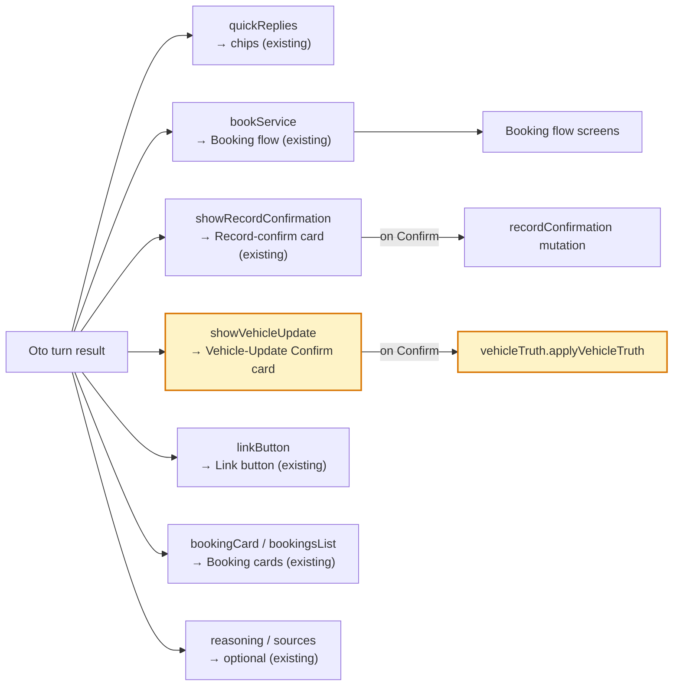
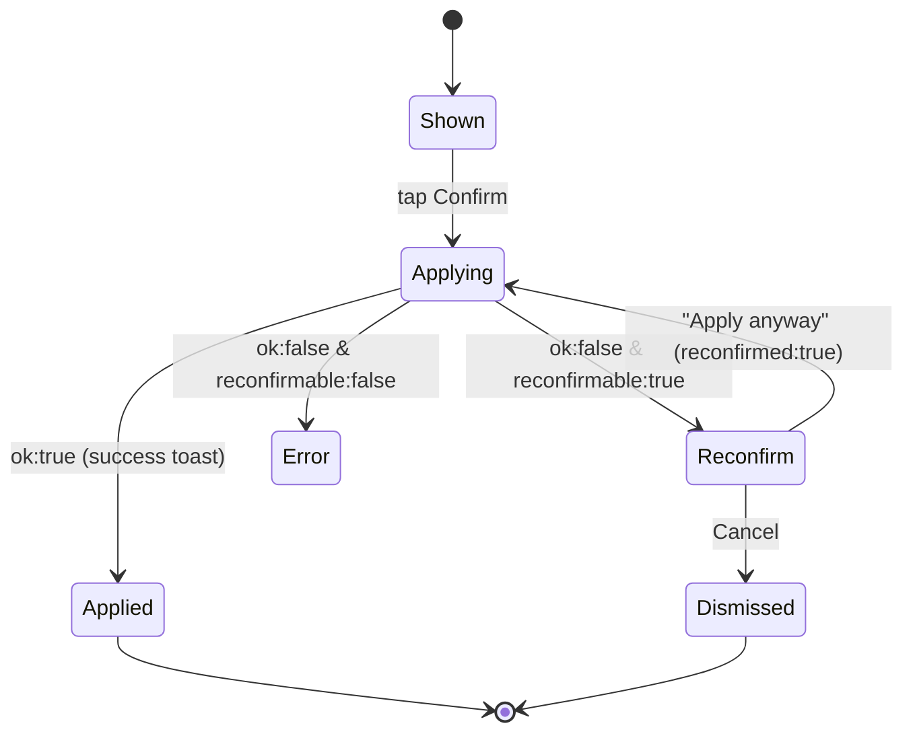
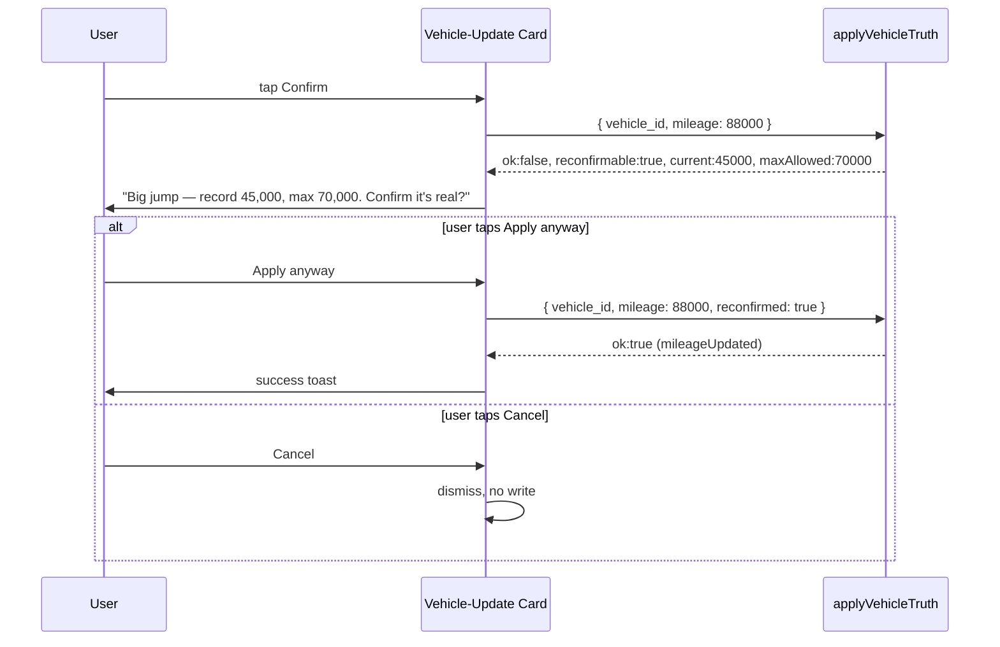
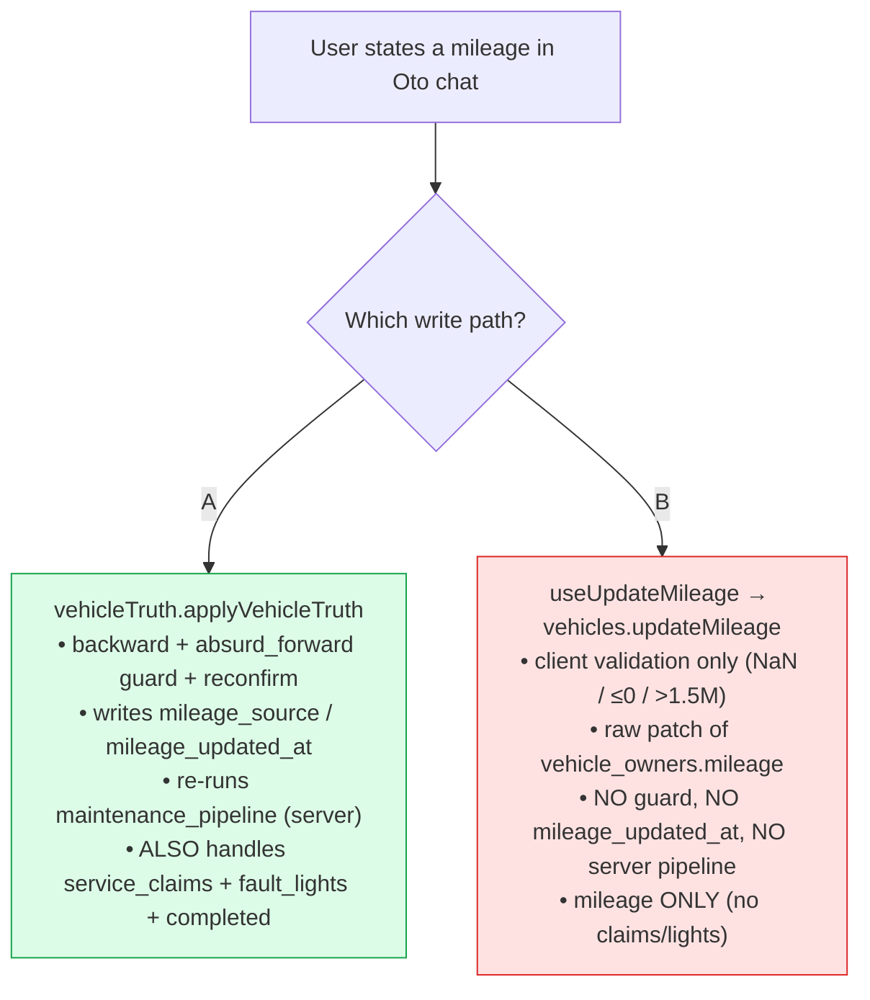

# Oto Mobile Page — Updates to Plan (Schematic + Contracts)

**Date:** 2026-06-25 · **Source:** otopair-web `waleed-fix` (Oto backend + director-sim work)
**Audience:** mobile team (otopair / Oto chat page) · **Goal:** everything below is a backend/contract change that already shipped on the Convex side — the mobile Oto chat page needs matching UI to consume it.

---

## TL;DR — what the mobile Oto page must build

| # | Mobile work | Why | Size |
|---|---|---|---|
| 1 | **Render the Vehicle-Update Confirm card** when the turn result has `showVehicleUpdate` | The directive was previously DROPPED in the backend and is now forwarded — Oto fires it for mileage, fault lights, and service claims | ★ headline |
| 2 | **Reconfirm sub-flow** on the card (Apply-anyway / Cancel) | A big-but-real mileage jump comes back `reconfirmable` and must be re-sent with `reconfirmed:true` | medium |
| 3 | **Handle `kind:"completed"` service claims** in the card | New kind: "I did my brakes" records the service DONE (clears the flag, raises the score) instead of flagging it | small |
| 4 | **Fault-light capture surfaces a card** | A named warning light ("check engine light is on") now fires `render_vehicle_update` with `fault_lights` — the card must render that | small |
| 5 | **Decide the mileage write path** (see §6) | `applyVehicleTruth` (guard + pipeline) vs the new `useUpdateMileage` hook (raw patch) — they diverge | decision |
| 6 | **Confirm all 9 render directives have a renderer** | Audit found `showVehicleUpdate` was the one with no path; verify the rest are wired | audit |

A full reference implementation already exists in the **director sim** (`app/(director-panel)/director/components/tabs/TabOtoSim.tsx` + `renderDirectiveSummary.ts`) — mobile can mirror its logic (see §7).

---

## 1. The turn result contract (what `sendMessage` returns)

Every Oto turn returns `text` plus **whichever render directive fired**. The mobile chat keys off which field is non-null to decide what to draw. Source of truth: `convex/oto/chat.ts` `SendMessageResult`.

```ts
type OtoTurnResult = {
  text: string;
  quickReplies?: QuickReply[];                       // tappable chips
  showRecordConfirmation?: { vehicle_id: string; maintenance_type: string };
  showVehicleUpdate?: {                              // ★ NEWLY FORWARDED (was dropped)
    mileage?: number;
    service_claims?: { service_slug: string; kind: "due" | "light_on" | "completed" }[];
    fault_lights?: string[];                          // e.g. ["check_engine"]
  };
  bookService?: { service_slugs: string[]; diagnostic_system?: string; customer_notes?: string; /* … */ };
  linkButton?: { destination: LinkDestination; label?: string };
  bookingCard?: { booking_id: string };
  bookingsList?: { booking_ids: string[] };
  reasoning?: unknown;
  sources?: unknown;
  error_kind?: "overloaded" | "transient" | "minimal_mode" | "ladder_down";
};
```

---

## 2. Render directive → mobile component map



> The **yellow** node is the new/changed surface for this update. Everything else should already have a mobile renderer — item #6 is just confirming that.

---

## 3. ★ The Vehicle-Update Confirm card (the headline)

`render_vehicle_update` is a **trigger-only** render: Oto captures user-stated vehicle truth (a mileage reading, a named fault light, and/or a service the user reports due/done) and the card is the **one-tap confirm** before it's written. One card can carry any combination of the three payload fields.

What the card must show, by payload field:

| Field present | Card shows | On confirm → `applyVehicleTruth` arg |
|---|---|---|
| `mileage: 100000` | "Update odometer to **100,000 mi**" | `mileage` |
| `service_claims:[{brake_pad_replacement, due}]` | "Flag **Brake Pad Replacement** as due" | `service_claims` |
| `service_claims:[{brake_pad_replacement, completed}]` | "Log **Brake Pad Replacement** as **done**" (✓, not a flag) | `service_claims` |
| `fault_lights:["check_engine"]` | "Log **Check-Engine light**" | `fault_lights` |

### Card state machine



---

## 4. `applyVehicleTruth` — the confirm action contract

`api.vehicles…` no — **`api.vehicleTruth.applyVehicleTruth`** (auth-gated to the signed-in user; mobile passes the real Clerk identity).

```ts
applyVehicleTruth({
  vehicle_id: string,                 // the active vehicle's Convex id
  mileage?: number,
  service_claims?: { service_slug: string; kind: "due" | "light_on" | "completed" }[],
  fault_lights?: string[],
  reconfirmed?: boolean,              // ONLY set after the user taps "Apply anyway"
})
```

Returns one of three shapes — the mobile branches on them:

```ts
// (a) success
{ ok: true, mileageUpdated: boolean, servicesFlagged: string[],
  servicesCompleted: string[], faultLightsAdded: string[] }

// (b) reconfirmable rejection (a big-but-real forward odometer jump)
{ ok: false, needsReconfirm: true, reconfirmable: true,
  reason: "absurd_forward", current: number, proposed: number, maxAllowed: number }

// (c) hard rejection (cannot be overridden)
{ ok: false, needsReconfirm: true, reconfirmable: false,
  reason: "backward" | "implausible", current, proposed, maxAllowed }
```

Copy the mobile should show:
- **(a)** success toast — e.g. "Mileage updated", or "Logged Brake Pad Replacement as done".
- **(b)** reconfirm prompt — *"Big jump — record shows {current} mi, and {proposed} is past the one-step limit of {maxAllowed}. Confirm it's real?"* + **Apply anyway** / **Cancel**.
- **(c)** plain error — `backward` → *"That's below the recorded {current} mi — an odometer can't go backward."*; `implausible` → *"That isn't a valid odometer reading."* (no override).

---

## 5. The reconfirm flow (sequence)



`backward` / `implausible` are **never** reconfirmable — no "Apply anyway" button; show the plain error and stop.

---

## 6. ⚠ Open decision — the mileage write path

There are now **two** ways to write a mileage on the mobile side, and they diverge. This needs a team decision before the card is wired:



- The Vehicle-Update card carries mileage **plus** service_claims/fault_lights in one confirm — the hook only does mileage, so the card needs `applyVehicleTruth` for the rest regardless.
- Routing mileage through the bare hook **loses** the reconfirm/backward guard + server recompute we just built.
- **Recommended:** make `vehicles.updateMileage` the shared server write (move the guard + `mileage_updated_at` into it, add a `reconfirmed` + optional `runPipeline` flag), and have `applyVehicleTruth` delegate to it — then the cars-page modal hook and the Oto card share one hardened path. (Pending confirmation with the hook author.)

---

## 7. Reference implementation (already built — mirror it)

The director "Oto Sim" already renders **all** directives and fully implements the Vehicle-Update card + reconfirm, against the same backend. Mobile can lift the logic:

| Concern | Web reference file |
|---|---|
| directive → display row (covers all 9 + a catch-all) | `app/(director-panel)/director/components/tabs/renderDirectiveSummary.ts` |
| card render + Confirm button + reconfirm sub-state + success/error copy | `app/(director-panel)/director/components/tabs/TabOtoSim.tsx` (`confirmVehicleUpdate`, `rejectionMessage`, card JSX) |
| backend action (web/sim path) | `convex/vehicleTruth.ts` `applyVehicleTruthForDirector` (mobile uses the auth-gated `applyVehicleTruth` instead) |

> Note the sim uses `applyVehicleTruthForDirector(token, userId, vehicleVin, …)` because the director panel has no end-user identity. **Mobile uses `applyVehicleTruth(vehicle_id, …)`** with the real Clerk session — same args otherwise (mileage / service_claims / fault_lights / reconfirmed) and identical return shapes.

---

## 8. Mobile checklist

- [ ] Add a renderer for `showVehicleUpdate` → **Vehicle-Update Confirm card**.
- [ ] Card displays mileage / service_claims (label `due` vs `light_on` vs **`completed`**) / fault_lights.
- [ ] Confirm → `applyVehicleTruth(vehicle_id, …payload)`.
- [ ] Branch on the 3 return shapes: success toast · reconfirm prompt (Apply-anyway re-sends `reconfirmed:true`) · hard error.
- [ ] `completed` claims read as "logged as done", not "flagged".
- [ ] Named fault light ("check engine light on") renders the card with `fault_lights`.
- [ ] Resolve §6 (mileage write path) before wiring Confirm.
- [ ] Verify the other 8 directives (`bookService`, `showRecordConfirmation`, `linkButton`, `bookingCard`, `bookingsList`, `quickReplies`, `reasoning`, `sources`) all already render — `showVehicleUpdate` was the only gap found in the audit.

---

### Backend changes this references (otopair-web `waleed-fix`, already merged on that branch)
- `render_vehicle_update` directive now forwarded in the turn result (was produced but dropped).
- `applyVehicleTruth`: `reconfirmed` override for `absurd_forward`; richer rejection payload (`reconfirmable`/`current`/`proposed`/`maxAllowed`); `service_claims.kind:"completed"` records-done; `servicesCompleted` in the success result.
- Prompt v0.33: named warning light (incl. check-engine) logs via `render_vehicle_update` this turn.
- Director sim renders all 9 directives + the interactive Vehicle-Update card with reconfirm.
